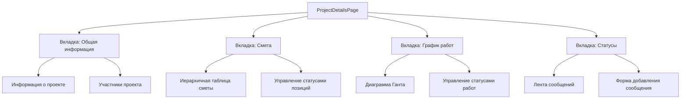

# План разработки страницы детального просмотра проекта

## Обзор задачи

Создание страницы детального просмотра проекта с вкладками для сметы, графика работ и статусов. Эта страница будет центральным местом для управления всеми аспектами проекта ремонта.

## Текущее состояние

В настоящее время в приложении есть:
- Модели данных для проектов, смет, графиков работ и статусов
- Дашборд с списком проектов и кнопками для перехода к деталям проекта
- Закомментированные маршруты в App.tsx для страниц проекта

## Архитектурное решение

Вместо создания отдельных страниц для каждого аспекта проекта (детали, смета, график, статус), мы создадим единую страницу с вкладками. Это улучшит пользовательский опыт, позволяя быстро переключаться между различными аспектами проекта без необходимости загружать новую страницу.

## Компоненты для реализации

1. **ProjectDetailsPage** - основная страница с вкладками
   - Загрузка данных проекта
   - Управление состоянием вкладок
   - Обработка прав доступа в зависимости от роли пользователя

2. **ProjectInfoTab** - вкладка с общей информацией о проекте
   - Отображение основной информации (название, адрес, даты, статус)
   - Список участников проекта с их ролями
   - Кнопки для редактирования информации (для пользователей с соответствующими правами)

3. **EstimateTab** - вкладка со сметой
   - Иерархичная таблица с возможностью разворачивать/сворачивать пункты
   - Отображение статусов позиций с цветовым выделением
   - Функциональность для изменения статусов (для пользователей с соответствующими правами)

4. **ScheduleTab** - вкладка с графиком работ
   - Диаграмма Ганта для визуализации графика работ
   - Отображение статусов работ с цветовым выделением
   - Функциональность для изменения статусов (для пользователей с соответствующими правами)

5. **StatusTab** - вкладка с текущим статусом и историей статусов
   - Лента сообщений с возможностью прикрепления файлов
   - Форма для добавления новых сообщений
   - Отображение прикрепленных файлов (фото, документы)

## Технические детали

### API эндпоинты

Для реализации страницы потребуются следующие API эндпоинты:

1. `GET /api/projects/:id` - получение информации о проекте
2. `GET /api/projects/:id/users` - получение списка участников проекта
3. `GET /api/projects/:id/estimate` - получение сметы проекта
4. `GET /api/projects/:id/schedule` - получение графика работ проекта
5. `GET /api/projects/:id/status` - получение истории статусов проекта
6. `POST /api/projects/:id/status` - добавление нового сообщения о статусе
7. `PATCH /api/projects/:id/estimate/:itemId` - обновление статуса позиции сметы
8. `PATCH /api/projects/:id/schedule/:itemId` - обновление статуса работы в графике

### Библиотеки и компоненты

1. **Material-UI Tabs** - для создания вкладок
2. **React Table** - для создания иерархичной таблицы сметы
3. **React Gantt Chart** - для визуализации графика работ
4. **Material-UI Cards** - для отображения сообщений о статусе
5. **Dropzone** - для загрузки файлов

## План реализации

### 1. Создание базовой структуры страницы

1. Создать компонент `ProjectDetailsPage`
2. Реализовать загрузку данных проекта
3. Создать структуру вкладок с использованием Material-UI Tabs
4. Настроить маршрутизацию в App.tsx

### 2. Реализация вкладки "Общая информация"

1. Создать компонент `ProjectInfoTab`
2. Реализовать отображение основной информации о проекте
3. Добавить список участников проекта
4. Реализовать функциональность редактирования информации (для пользователей с соответствующими правами)

### 3. Реализация вкладки "Смета"

1. Создать компонент `EstimateTab`
2. Реализовать иерархичную таблицу с использованием React Table
3. Добавить функциональность разворачивания/сворачивания пунктов
4. Реализовать отображение и изменение статусов позиций

### 4. Реализация вкладки "График работ"

1. Создать компонент `ScheduleTab`
2. Реализовать диаграмму Ганта с использованием React Gantt Chart
3. Добавить отображение статусов работ с цветовым выделением
4. Реализовать функциональность изменения статусов работ

### 5. Реализация вкладки "Статусы"

1. Создать компонент `StatusTab`
2. Реализовать ленту сообщений с использованием Material-UI Cards
3. Добавить форму для создания новых сообщений
4. Реализовать функциональность загрузки и отображения файлов

### 6. Тестирование и оптимизация

1. Тестирование функциональности на различных устройствах
2. Оптимизация производительности
3. Проверка прав доступа для различных ролей пользователей

## Оценка времени

| Задача | Оценка времени |
|--------|----------------|
| Создание базовой структуры страницы | 4 часа |
| Реализация вкладки "Общая информация" | 6 часов |
| Реализация вкладки "Смета" | 10 часов |
| Реализация вкладки "График работ" | 8 часов |
| Реализация вкладки "Статусы" | 8 часов |
| Тестирование и оптимизация | 4 часа |
| **Итого** | **40 часов** |

## Потенциальные проблемы и решения

1. **Проблема**: Сложность реализации иерархичной таблицы сметы с возможностью разворачивания/сворачивания пунктов.
   **Решение**: Использовать библиотеку React Table с поддержкой вложенных данных или реализовать собственный компонент с рекурсивным рендерингом.

2. **Проблема**: Производительность при большом количестве позиций в смете или сообщений о статусе.
   **Решение**: Реализовать пагинацию или виртуализацию списков для оптимизации производительности.

3. **Проблема**: Сложность реализации диаграммы Ганта для графика работ.
   **Решение**: Использовать готовую библиотеку React Gantt Chart или адаптировать другие библиотеки для визуализации временных данных.

4. **Проблема**: Управление правами доступа для различных ролей пользователей.
   **Решение**: Реализовать проверку прав доступа на уровне компонентов и API эндпоинтов.

## Заключение

Реализация страницы детального просмотра проекта с вкладками для сметы, графика работ и статусов является важным шагом в разработке сервиса для управления ремонтом квартир. Эта страница будет центральным местом для управления всеми аспектами проекта и обеспечит удобный пользовательский опыт для всех участников процесса.