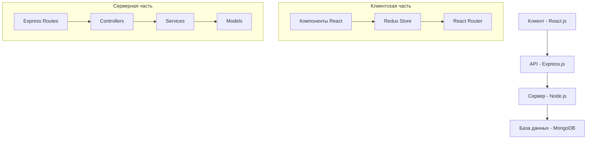
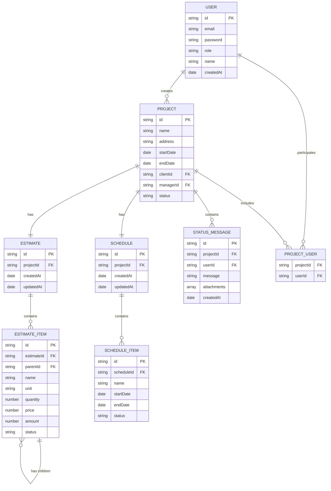

# План разработки сервиса для управления ремонтом квартир

## Обзор проекта

Сервис для управления ремонтом квартир, который позволяет отслеживать статус ремонта и баланс взаиморасчётов между заказчиком, компанией (генподрядчиком) и мастерами (субподрядчиками).

### Основные блоки

1. **Взаиморасчеты и смета**
   - Иерархичная таблица с возможностью разворачивать/сворачивать пункты
   - Отображение статусов позиций ("профинансировано", "выполнено", "переделываем", "принято")
   - Стандартные столбцы сметы (ед. изм., количество, цена, сумма)

2. **График работ**
   - Визуальное представление графика работ
   - Отображение статусов работ с цветовым выделением

3. **Текущий статус и история статусов**
   - Страница с обновляемым списком сообщений от сотрудников сервиса
   - Возможность прикреплять фото, видео, документы и ссылки

### Роли пользователей

1. **Заказчик** - видит всё, кроме прайсов для мастеров и смет для мастеров
2. **НеБригадир** - самый высокий уровень доступа, видит все данные по всем проектам
3. **Эксперт-приёмщик** - не видит смету, остальное всё видит
4. **Координатор**
5. **Мастер**
6. **Дизайнер**

## Функциональность MVP (1-2 месяца)

### 1. Основные блоки

1. **Взаиморасчеты и смета**
   - Базовая иерархичная таблица с возможностью разворачивать/сворачивать пункты
   - Отображение статусов позиций
   - Стандартные столбцы сметы

2. **График работ**
   - Простое визуальное представление графика работ
   - Базовое отображение статусов работ с цветовым выделением

3. **Текущий статус и история статусов**
   - Страница с обновляемым списком сообщений
   - Базовая возможность прикреплять фото и документы

### 2. Система пользователей

- Регистрация и авторизация
- Базовые роли пользователей (Заказчик, НеБригадир, остальные роли без детальной настройки прав)
- Простой личный кабинет

### 3. Управление проектами

- Создание и просмотр проектов
- Добавление участников в проект
- Базовое управление статусами проекта

## Функции для последующих версий

1. **Автоматический расчёт смет по PDF файлу дизайн-проекта**
2. **Расширенная система ролей и прав доступа**
3. **Интеграция с платежными системами**
4. **Расширенные прайс-листы**
5. **Расширенная функциональность загрузки файлов**

## Технический план реализации MVP

### 1. Архитектура системы

### 2. Технологический стек для MVP

**Фронтенд:**
- React.js (функциональные компоненты с хуками)
- Redux для управления состоянием
- React Router для маршрутизации
- Material-UI для компонентов интерфейса
- React Table для иерархичных таблиц
- React Gantt Chart для графика работ

**Бэкенд:**
- Node.js с Express.js
- MongoDB для базы данных
- Mongoose для ODM
- JWT для аутентификации
- Multer для загрузки файлов

**Инфраструктура:**
- GitHub для контроля версий
- Netlify/Vercel для хостинга фронтенда
- Heroku/DigitalOcean для хостинга бэкенда
- MongoDB Atlas для хостинга базы данных

### 3. Структура базы данных (упрощенная для MVP)

### 4. Этапы разработки MVP

**Неделя 1-2: Настройка проекта и базовая структура**
- Настройка окружения разработки
- Создание базовой структуры проекта (фронтенд и бэкенд)
- Настройка базы данных
- Разработка базовых моделей данных
- Настройка аутентификации и авторизации

**Неделя 3-4: Разработка основных модулей**
- Разработка модуля управления проектами
- Разработка базового модуля смет и взаиморасчетов
- Разработка базового модуля графика работ
- Разработка базового модуля статусов и коммуникации

**Неделя 5-6: Интеграция и тестирование**
- Интеграция всех модулей
- Разработка пользовательского интерфейса
- Тестирование функциональности
- Исправление ошибок
- Оптимизация производительности

**Неделя 7-8: Финализация и развертывание**
- Финальное тестирование
- Подготовка к развертыванию
- Развертывание MVP
- Документация и обучение пользователей

### 5. Пользовательский интерфейс MVP

**Основные экраны:**

1. **Авторизация и регистрация**
   - Простая форма входа
   - Форма регистрации с выбором роли

2. **Дашборд**
   - Список проектов
   - Основная информация о проектах

3. **Страница проекта**
   - Основная информация о проекте
   - Навигация по разделам проекта

4. **Раздел "Взаиморасчеты и смета"**
   - Иерархичная таблица сметы
   - Управление статусами позиций

5. **Раздел "График работ"**
   - Диаграмма Ганта
   - Управление статусами работ

6. **Раздел "Текущий статус и история"**
   - Лента сообщений
   - Форма добавления сообщения с возможностью прикрепления файлов