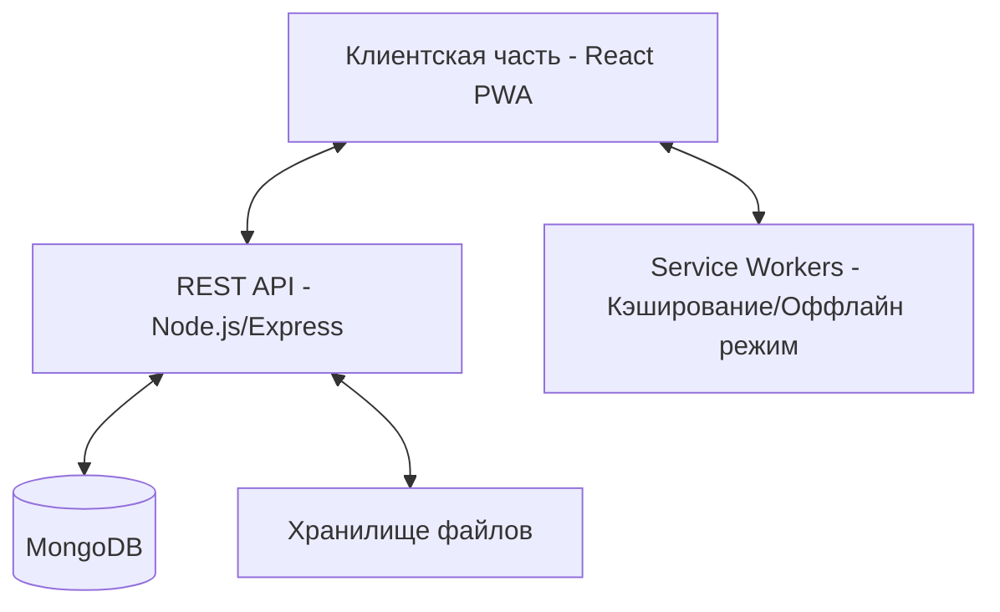
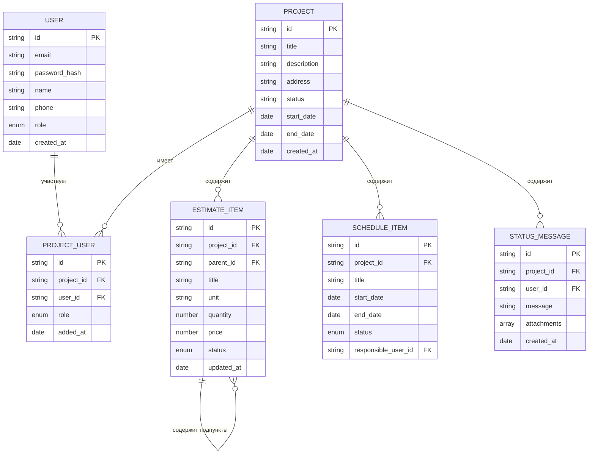
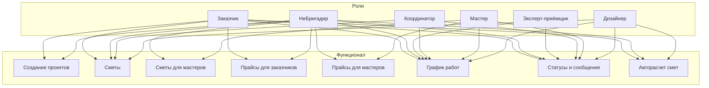

# План разработки сервиса для управления ремонтом квартир

## 1. Архитектура приложения

### Общая архитектура

### Архитектура базы данных

## 2. Компоненты системы

### Бэкенд (Node.js/Express)

1. **Аутентификация и авторизация**
   - Регистрация и вход пользователей
   - JWT токены для авторизации
   - Middleware для проверки ролей и прав доступа

2. **API для проектов**
   - CRUD операции для проектов
   - Управление участниками проекта
   - Фильтрация и поиск проектов

3. **API для смет**
   - Управление иерархическими пунктами сметы
   - Обновление статусов пунктов
   - Расчет итоговых сумм

4. **API для графика работ**
   - Создание и редактирование задач
   - Управление сроками и статусами
   - Назначение ответственных

5. **API для статусов и сообщений**
   - Добавление сообщений и комментариев
   - Загрузка и хранение вложений (фото, видео, документы)
   - Получение истории сообщений

6. **API для прайс-листов**
   - Управление прайс-листами для заказчиков и мастеров
   - Фильтрация и поиск по прайс-листам

7. **Сервис для автоматического расчета смет**
   - Обработка PDF файлов дизайн-проектов
   - Извлечение данных и формирование сметы

### Фронтенд (React PWA)

1. **Компоненты аутентификации**
   - Формы регистрации и входа
   - Выбор роли при регистрации
   - Управление профилем пользователя

2. **Компоненты проектов**
   - Список проектов
   - Создание и редактирование проектов
   - Управление участниками проекта

3. **Компоненты смет**
   - Иерархическая таблица сметы с возможностью сворачивания/разворачивания
   - Редактирование пунктов сметы
   - Управление статусами пунктов
   - Интеграция с прайс-листами

4. **Компоненты графика работ**
   - Интерактивный график Ганта
   - Редактирование задач и сроков
   - Управление статусами задач

5. **Компоненты статусов и сообщений**
   - Лента сообщений с историей
   - Форма добавления сообщений с вложениями
   - Комментарии к сообщениям

6. **Компоненты прайс-листов**
   - Таблицы прайс-листов с фильтрацией
   - Разные представления для разных ролей

7. **Компоненты автоматического расчета смет**
   - Загрузка и обработка PDF файлов
   - Предпросмотр и редактирование результатов

8. **PWA функциональность**
   - Service Workers для кэширования и оффлайн-режима
   - Push-уведомления
   - Установка на домашний экран

## 3. Роли пользователей и права доступа

## 4. Детальный список задач для разработки

### Этап 0: Подготовка проекта
1. **Настройка репозитория и структуры проекта**
   - Создание репозитория Git
   - Настройка структуры проекта (папки для бэкенда и фронтенда)
   - Настройка базовых конфигурационных файлов

2. **Настройка окружения разработки**
   - Настройка Node.js и npm
   - Настройка MongoDB
   - Настройка инструментов разработки (ESLint, Prettier)

### Этап 1: База данных и модели данных
1. **Проектирование схемы базы данных**
   - Определение коллекций и их структуры
   - Определение связей между коллекциями
   - Документирование схемы базы данных

2. **Реализация моделей данных**
   - Создание моделей Mongoose для всех сущностей
   - Реализация валидации данных
   - Настройка индексов для оптимизации запросов

### Этап 2: Бэкенд - Базовая инфраструктура
1. **Настройка Express.js сервера**
   - Настройка базового сервера
   - Настройка middleware (cors, body-parser, etc.)
   - Настройка маршрутизации

2. **Реализация системы аутентификации**
   - Создание API для регистрации пользователей
   - Реализация входа и генерации JWT токенов
   - Настройка middleware для проверки токенов
   - Реализация управления ролями и правами доступа

3. **Реализация API для управления пользователями**
   - CRUD операции для пользователей
   - Управление ролями пользователей
   - Обработка профилей пользователей

### Этап 3: Бэкенд - API для проектов и участников
1. **Реализация API для проектов**
   - CRUD операции для проектов
   - Фильтрация и поиск проектов
   - Обработка метаданных проектов

2. **Реализация API для управления участниками проектов**
   - Добавление/удаление участников проекта
   - Управление ролями участников
   - Получение списка участников проекта

### Этап 4: Бэкенд - API для смет и взаиморасчетов
1. **Реализация API для управления сметами**
   - CRUD операции для пунктов сметы
   - Управление иерархической структурой сметы
   - Расчет итоговых сумм

2. **Реализация API для управления статусами пунктов сметы**
   - Обновление статусов пунктов
   - Валидация изменений статусов
   - Отслеживание истории изменений

### Этап 5: Бэкенд - API для графика работ
1. **Реализация API для управления задачами**
   - CRUD операции для задач
   - Управление сроками и зависимостями
   - Назначение ответственных

2. **Реализация API для управления статусами задач**
   - Обновление статусов задач
   - Валидация изменений статусов
   - Отслеживание истории изменений

### Этап 6: Бэкенд - API для статусов и сообщений
1. **Реализация API для управления сообщениями**
   - CRUD операции для сообщений
   - Управление комментариями
   - Фильтрация и поиск сообщений

2. **Реализация API для управления вложениями**
   - Загрузка и хранение файлов
   - Обработка различных типов вложений
   - Получение и удаление вложений

### Этап 7: Бэкенд - API для прайс-листов
1. **Реализация API для управления прайс-листами**
   - CRUD операции для прайс-листов
   - Управление категориями и позициями
   - Фильтрация и поиск по прайс-листам

### Этап 8: Бэкенд - Сервис автоматического расчета смет
1. **Модуль загрузки и хранения PDF файлов**
   - Реализация API для загрузки PDF файлов
   - Валидация загружаемых файлов (проверка формата, размера)
   - Хранение файлов в файловой системе или облачном хранилище
   - Управление метаданными файлов (связь с проектами, пользователями)

2. **Модуль извлечения данных из PDF**
   - Интеграция с библиотекой pdf.js для работы с PDF
   - Извлечение текстового содержимого из PDF
   - Распознавание структуры документа (заголовки, разделы, таблицы)
   - Определение границ таблиц и извлечение табличных данных

3. **Модуль распознавания элементов дизайн-проекта**
   - Распознавание типов помещений (кухня, ванная, спальня и т.д.)
   - Определение размеров помещений (площадь, периметр)
   - Распознавание элементов отделки (стены, потолки, полы)
   - Распознавание мебели и оборудования
   - Определение материалов и их характеристик

4. **Модуль анализа и классификации данных**
   - Классификация распознанных элементов по категориям работ
   - Сопоставление элементов с позициями прайс-листа
   - Определение количества и единиц измерения
   - Расчет стоимости на основе прайс-листа
   - Обработка неопределенных или неоднозначных данных

5. **Модуль формирования сметы**
   - Создание иерархической структуры сметы
   - Группировка позиций по категориям работ
   - Расчет итоговых сумм по разделам и всей смете
   - Применение коэффициентов и наценок
   - Формирование финальной сметы в структурированном виде

6. **Модуль обучения и улучшения алгоритмов**
   - Сбор данных о корректировках, вносимых пользователями
   - Анализ ошибок распознавания и классификации
   - Улучшение алгоритмов на основе собранных данных
   - Адаптация к различным форматам дизайн-проектов

### Этап 9: Фронтенд - Настройка и базовые компоненты
1. **Настройка React приложения**
   - Создание проекта с помощью Create React App
   - Настройка маршрутизации (React Router)
   - Настройка управления состоянием (Redux или Context API)

2. **Реализация базовых компонентов UI**
   - Создание компонентов навигации
   - Создание компонентов форм
   - Создание компонентов таблиц и списков

3. **Реализация компонентов аутентификации**
   - Создание форм регистрации и входа
   - Реализация управления токенами
   - Создание защищенных маршрутов

### Этап 10: Фронтенд - Компоненты для проектов
1. **Реализация компонентов для работы с проектами**
   - Создание списка проектов
   - Создание форм создания и редактирования проектов
   - Реализация переключения между проектами

2. **Реализация компонентов для управления участниками**
   - Создание списка участников проекта
   - Создание форм добавления и редактирования участников
   - Реализация управления ролями участников

### Этап 11: Фронтенд - Компоненты для смет
1. **Реализация компонента иерархической таблицы сметы**
   - Создание компонента с возможностью сворачивания/разворачивания
   - Реализация редактирования пунктов сметы
   - Реализация расчета итоговых сумм

2. **Реализация компонентов для управления статусами**
   - Создание выпадающих списков для выбора статуса
   - Реализация цветовой индикации статусов
   - Реализация фильтрации по статусам

### Этап 12: Фронтенд - Компоненты для графика работ
1. **Реализация компонента интерактивного графика Ганта**
   - Создание визуального представления задач
   - Реализация перетаскивания и изменения размеров задач
   - Реализация отображения зависимостей между задачами

2. **Реализация компонентов для управления задачами**
   - Создание форм создания и редактирования задач
   - Реализация управления сроками и ответственными
   - Реализация управления статусами задач

### Этап 13: Фронтенд - Компоненты для статусов и сообщений
1. **Реализация компонента ленты сообщений**
   - Создание хронологического списка сообщений
   - Реализация отображения информации о пользователе и времени
   - Реализация пагинации и подгрузки сообщений

2. **Реализация компонентов для работы с сообщениями**
   - Создание формы добавления сообщений
   - Реализация загрузки вложений
   - Реализация комментариев к сообщениям

### Этап 14: Фронтенд - Компоненты для прайс-листов
1. **Реализация компонентов для работы с прайс-листами**
   - Создание таблиц прайс-листов
   - Реализация фильтрации и поиска
   - Реализация разных представлений для разных ролей

### Этап 15: Фронтенд - Компоненты для автоматического расчета смет
1. **Компонент загрузки PDF файлов**
   - Интерфейс для выбора и загрузки файлов
   - Отображение прогресса загрузки
   - Предпросмотр загруженных файлов
   - Управление метаданными файлов

2. **Компонент отображения процесса обработки**
   - Визуализация этапов обработки PDF
   - Индикаторы прогресса для каждого этапа
   - Отображение промежуточных результатов
   - Возможность прерывания процесса

3. **Компонент предпросмотра распознанных данных**
   - Отображение распознанных элементов дизайн-проекта
   - Визуализация соответствия элементов и позиций сметы
   - Интерфейс для корректировки неправильно распознанных данных
   - Возможность добавления пропущенных элементов

4. **Компонент редактирования сформированной сметы**
   - Интерфейс для редактирования позиций сметы
   - Возможность изменения количества, цен и коэффициентов
   - Добавление и удаление позиций
   - Перегруппировка позиций по категориям

5. **Компонент сравнения и анализа**
   - Сравнение автоматически сформированной сметы с ручными корректировками
   - Визуализация различий и изменений
   - Статистика по категориям работ и материалов
   - Анализ стоимости по помещениям и типам работ

### Этап 16: PWA функциональность
1. **Настройка Service Workers**
   - Настройка кэширования статических ресурсов
   - Реализация оффлайн-режима
   - Настройка обновления кэша

2. **Реализация дополнительных PWA функций**
   - Настройка манифеста приложения
   - Реализация push-уведомлений
   - Оптимизация для установки на домашний экран

### Этап 17: Тестирование и оптимизация
1. **Функциональное тестирование**
   - Тестирование API
   - Тестирование компонентов фронтенда
   - Тестирование интеграции компонентов

2. **Тестирование на различных устройствах**
   - Тестирование на десктопах
   - Тестирование на мобильных устройствах
   - Тестирование в различных браузерах

3. **Оптимизация производительности**
   - Оптимизация запросов к базе данных
   - Оптимизация рендеринга компонентов
   - Оптимизация загрузки ресурсов

### Этап 18: Развертывание
1. **Настройка серверной инфраструктуры**
   - Настройка сервера для бэкенда
   - Настройка сервера для фронтенда
   - Настройка базы данных

2. **Настройка CI/CD**
   - Настройка автоматической сборки
   - Настройка автоматического тестирования
   - Настройка автоматического развертывания

## 5. Последовательность разработки

Предлагается следующая последовательность разработки:

1. **Сначала база данных и модели данных**
   - Это фундамент всего приложения
   - Позволит четко определить структуру данных перед началом разработки API

2. **Затем бэкенд (API)**
   - Разработка API для всех основных функциональных блоков
   - Тестирование API с помощью инструментов типа Postman
   - Документирование API для использования при разработке фронтенда

3. **Потом фронтенд**
   - Разработка компонентов UI для всех функциональных блоков
   - Интеграция с API
   - Тестирование взаимодействия с бэкендом

4. **В конце PWA функциональность и оптимизация**
   - Добавление Service Workers и других PWA функций
   - Оптимизация производительности
   - Финальное тестирование и отладка

## 6. Технологии и инструменты

### Бэкенд
- **Node.js** - среда выполнения JavaScript
- **Express.js** - фреймворк для создания веб-приложений
- **MongoDB** - NoSQL база данных
- **Mongoose** - ODM для MongoDB
- **JWT** - для аутентификации и авторизации
- **Multer** - для обработки файлов
- **pdf.js** - для работы с PDF файлами

### Фронтенд
- **React** - библиотека для создания пользовательских интерфейсов
- **React Router** - для маршрутизации
- **Redux** или **Context API** - для управления состоянием
- **Material-UI** или **Ant Design** - для компонентов UI
- **Axios** - для HTTP запросов
- **React-PDF** - для работы с PDF файлами
- **React-Gantt** - для создания графика Ганта

### PWA
- **Workbox** - для работы с Service Workers
- **Web Push API** - для push-уведомлений
- **IndexedDB** - для хранения данных в браузере

### Инструменты разработки
- **Git** - для контроля версий
- **ESLint** - для статического анализа кода
- **Prettier** - для форматирования кода
- **Jest** - для тестирования
- **Webpack** - для сборки приложения